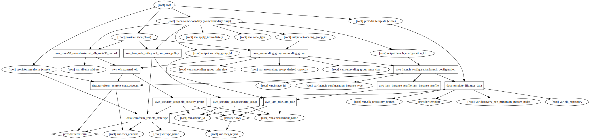

# ELK Terraform Module

This module creates an ELK stack with an Elasticsearch cluster.



## Example Usage

```
module "elk" {
  source = ""

  vpc_name = "${module.environment.vpc_name}"
  aws_region = "${module.environment.aws_region}"
  aws_account = "${module.environment.aws_account}"
  environment_name = "${module.environment.environment_name}"
  unique_id = "sysadvent-"
}
```

## Generate graph

```bash
terraform graph -draw-cycles | dot -Tsvg -o graph.svg
```

# Resources

* [AWS Blog - CloudWatch to ELK](https://aws.amazon.com/blogs/aws/cloudwatch-logs-subscription-consumer-elasticsearch-kibana-dashboards/)
* [Elasticsearch - EC2 Discovery Plugin](https://www.elastic.co/guide/en/elasticsearch/plugins/current/discovery-ec2.html)
* [Logstash - Input Plugins Use Enviroment Variables](https://www.elastic.co/guide/en/logstash/current/environment-variables.html)
* [Logstash - Cloudwatch Log Input Blog Post](http://lukewaite.github.io/aws/lambda/elk/logstash/2015/07/13/aws-lambda-and-elk.html)
* [Logstash - Redis Input Pugin](https://www.elastic.co/guide/en/logstash/current/plugins-inputs-redis.html)
* [Logstash Book - Redis Configuration](https://read.amazon.com/?asin=B00B9JQTCO)
* [Stack Overflow - Public ELB to Private Subnet](http://stackoverflow.com/questions/22541895/amazon-elb-for-ec2-instances-in-private-subnet-in-vpc)
* [Terraform - Elasticache Cluster](https://www.terraform.io/docs/providers/aws/r/elasticache_cluster.html)
* [X-Pack](https://www.elastic.co/guide/en/x-pack/current/installing-xpack.html)
